---
## Front matter
title: "Внешний курс"
subtitle: "Раздел 1"
author: "Полякова Юлия Александровна"

## Generic otions
lang: ru-RU
toc-title: "Содержание"

## Bibliography
bibliography: bib/cite.bib
csl: pandoc/csl/gost-r-7-0-5-2008-numeric.csl

## Pdf output format
toc: true # Table of contents
toc-depth: 2
lof: true # List of figures
lot: true # List of tables
fontsize: 12pt
linestretch: 1.5
papersize: a4
documentclass: scrreprt
## I18n polyglossia
polyglossia-lang:
  name: russian
  options:
	- spelling=modern
	- babelshorthands=true
polyglossia-otherlangs:
  name: english
## I18n babel
babel-lang: russian
babel-otherlangs: english
## Fonts
mainfont: IBM Plex Serif
romanfont: IBM Plex Serif
sansfont: IBM Plex Sans
monofont: IBM Plex Mono
mathfont: STIX Two Math
mainfontoptions: Ligatures=Common,Ligatures=TeX,Scale=0.94
romanfontoptions: Ligatures=Common,Ligatures=TeX,Scale=0.94
sansfontoptions: Ligatures=Common,Ligatures=TeX,Scale=MatchLowercase,Scale=0.94
monofontoptions: Scale=MatchLowercase,Scale=0.94,FakeStretch=0.9
mathfontoptions:
## Biblatex
biblatex: true
biblio-style: "gost-numeric"
biblatexoptions:
  - parentracker=true
  - backend=biber
  - hyperref=auto
  - language=auto
  - autolang=other*
  - citestyle=gost-numeric
## Pandoc-crossref LaTeX customization
figureTitle: "Рис."
tableTitle: "Таблица"
listingTitle: "Листинг"
lofTitle: "Список иллюстраций"
lotTitle: "Список таблиц"
lolTitle: "Листинги"
## Misc options
indent: true
header-includes:
  - \usepackage{indentfirst}
  - \usepackage{float} # keep figures where there are in the text
  - \floatplacement{figure}{H} # keep figures where there are in the text
---

# Цель работы

Получить базовые знания по работе с Linux с помощью внешнего курса на stepik.

# Задание

Пройти первый раздел "Введение". Выполнить тестовые и интерактивные задания.

# Выполнение этапов курса

1. Часть "Общая информация о курсе". Здесь представлены 2 ознакомительных задания.

Шаг 3 - (рис. [-@fig:001]). Название курса можно посмотреть в левом верхнем углу.

{#fig:001 width=90%}

Шаг 5 - (рис. [-@fig:002]). Мной были выбраны наиболее логичные утверждения (все видны на фото), соответствующие ценностям курса.

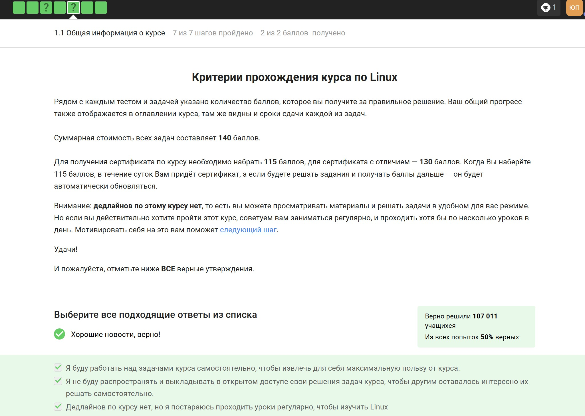{#fig:002 width=90%}

2. Часть "Как установить Linux". Здесь 3 задания.

Шаг 6 - (рис. [-@fig:003]). Windows, так как это основная ОС на моем ноутбуке.

{#fig:003 width=90%}

Шаг 8 - (рис. [-@fig:004]). Другие варианты не подходят, тем более я работаю на виртуальной машине и понимаю, что это.

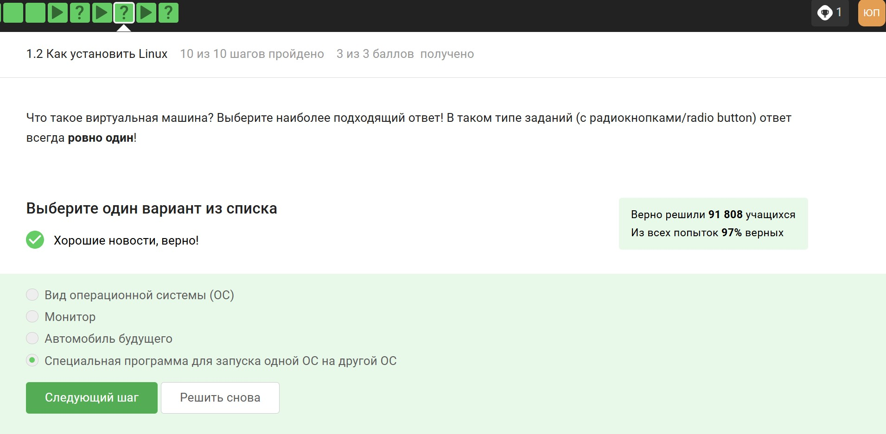{#fig:004 width=90%}

Шаг 10 - (рис. [-@fig:005]). Да, удалось.

{#fig:005 width=90%}

3. Часть "Осваиваем Linux". Здесь 4 задания.

Шаг 4 - (рис. [-@fig:006]). Для начала я установила через терминал LibreOffice. Затем я его открыла, создала файл и выполнила задание.

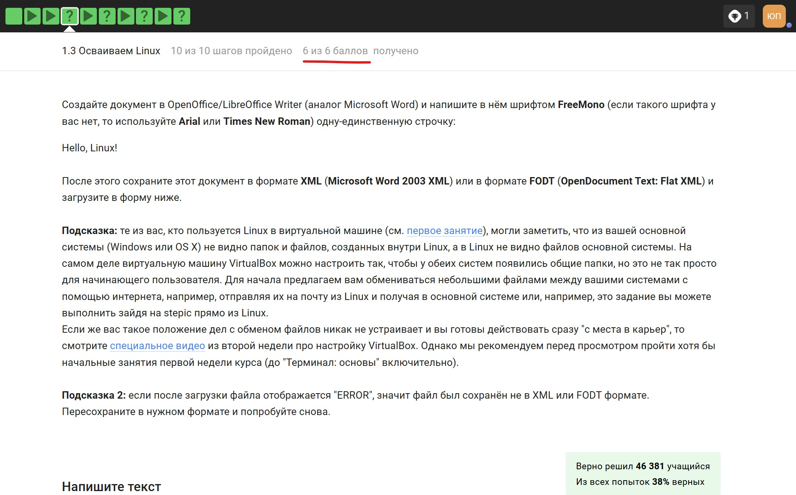{#fig:006 width=90%}

Скрин файла - (рис. [-@fig:007]).

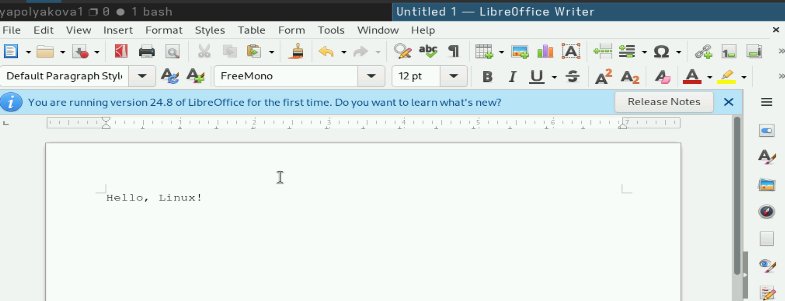{#fig:007 width=90%}

Шаг 6 - (рис. [-@fig:008]). Это формат для Debian систем, конкретно Ubuntu.

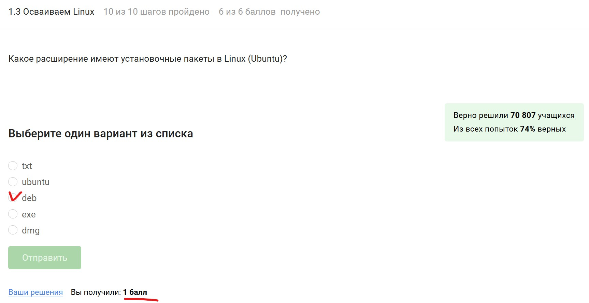{#fig:008 width=90%}

Шаг 8 - (рис. [-@fig:009]). Да, удалось.

{#fig:009 width=90%}

Скрин запуска VLC - (рис. [-@fig:010]). Да, удалось.

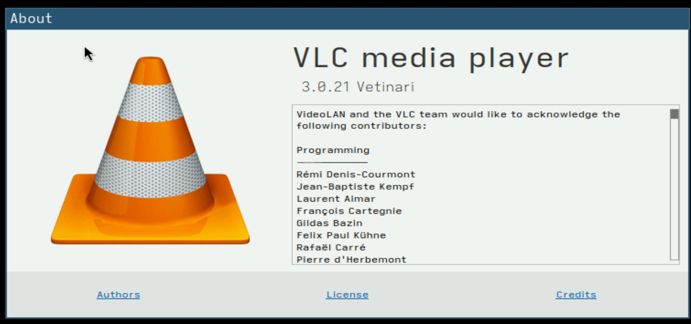{#fig:010 width=90%}

Шаг 10 - (рис. [-@fig:011]). Это Update менеджер, значит он для обновления.

{#fig:011 width=90%}

4. Часть "Terminal: основы". Здесь 5 заданий.

Шаг 3 - (рис. [-@fig:012]). Другие варианты абсурдны.

{#fig:012 width=90%}

Шаг 5 - (рис. [-@fig:013]). Регистр важен, верная команда - это pwd.

{#fig:013 width=90%}

Шаг 7 - (рис. [-@fig:014]). Порядок ключей и длинная или короткая запись ключа не важны, регистр и "-" перед ключами важны.

{#fig:014 width=90%}

Шаг 10 - (рис. [-@fig:015]). Мы находимся в Documents, поэтому эти две команды верны, другие из списка - нет.

{#fig:015 width=90%}

Шаг 12 - (рис. [-@fig:016]). Для удаления команда rm, -r это рекурсивное удаление каталога.

{#fig:016 width=90%}

5. Часть "Запуск исполняемых файлов". Здесь 3 задания.

Шаг 3 - (рис. [-@fig:017]). Проверила в своем терминале.

{#fig:017 width=90%}

Шаг 6 - (рис. [-@fig:018]). & обозначает фоновый процесс, поэтому нужно bg. Ctrl + C останавливает программу, поэтому этот вариант не подходит.

{#fig:018 width=90%}

Шаг 7 - (рис. [-@fig:019]). Здесь я скачала файл.

{#fig:019 width=90%}

Шаг 7 - (рис. [-@fig:020]). Я перешла в загрузки (cd), открыла доступ для исполнения (chmod +x), Затем запустила файл из текущего каталога (./). В конце я скопировала выведенный тескст и сдала в систему курса.

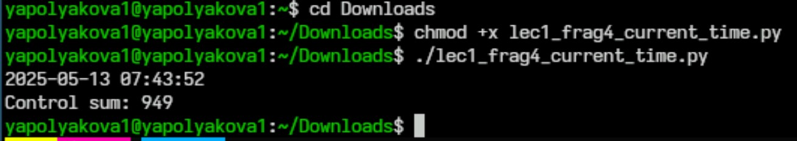{#fig:020 width=90%}

6. Часть "Ввод / вывод". Здесь 3 задания.

Шаг 4 - (рис. [-@fig:021]). Самый логичный ответ.

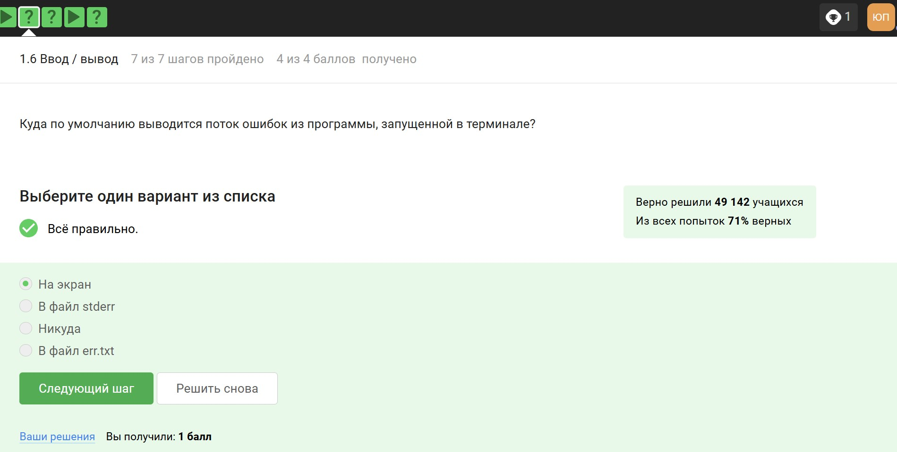{#fig:021 width=90%}

Шаг 5 - (рис. [-@fig:022]). Цифра 2 означает поток ошибок, > это запись в файл, а >> это дозапись.

{#fig:022 width=90%}

Шаг 7 - (рис. [-@fig:023]). Самый логичный ответ.

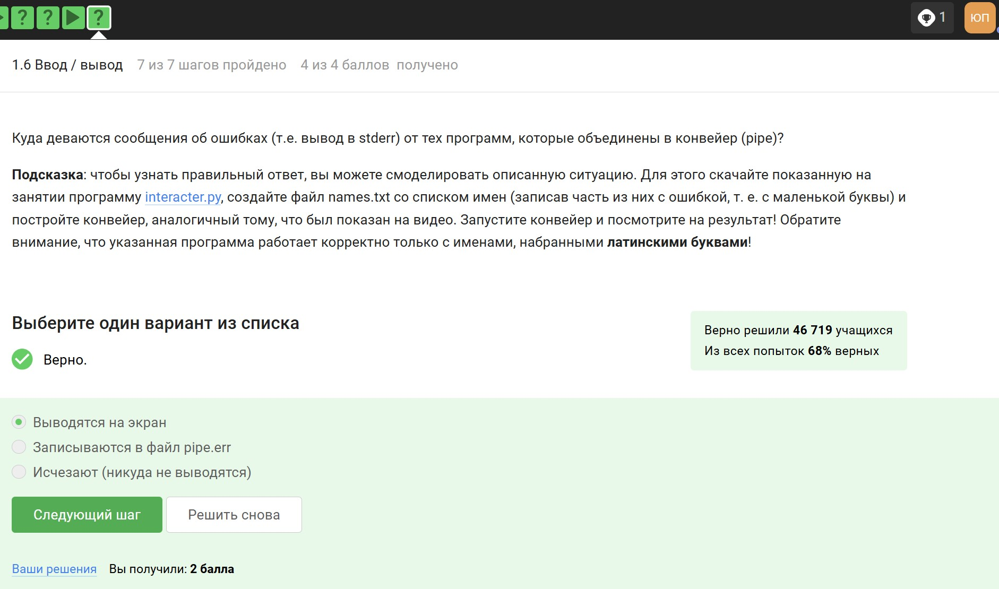{#fig:023 width=90%}

7. Часть "Скачивание файлов из интернета". Здесь 3 задания.

Шаг 3 - (рис. [-@fig:024]). Из-за ключей -P и -O файл сохранится именно так.

{#fig:024 width=90%}

Шаг 5 - (рис. [-@fig:025]). Я посмотрела справку, а также можно догадаться логически, потому что перевод названия команды - тишина.

{#fig:025 width=90%}

Шаг 7 - (рис. [-@fig:026]). Точно будут скачиваться jpg файлы, но здесь wget скачивает все файлы html, а потом удаляет ненужные.

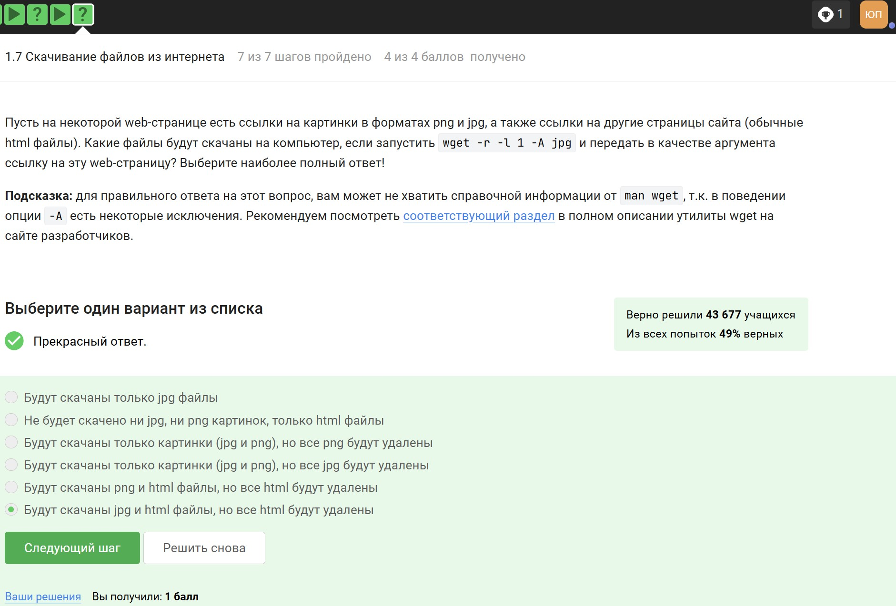{#fig:026 width=90%}

8. Часть "Работа с архивами". Здесь 3 задания.

Шаг 3 - (рис. [-@fig:027]). Этот ответ был в материалах видео, которое я ранее смотрела в предыдущем шаге.

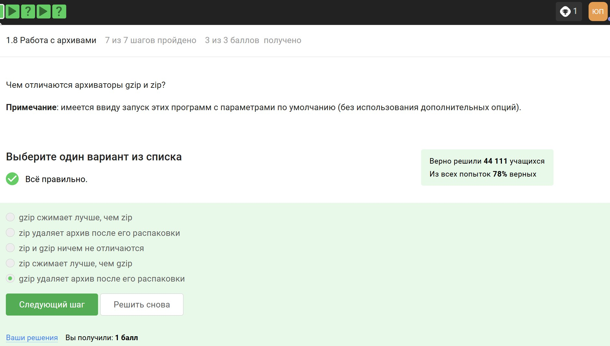{#fig:027 width=90%}

Шаг 5 - (рис. [-@fig:028]). tar - архиватор, значит да. gzip - это компрессор, он еще больше сжимает архив, поэтому нет. А zip - и архиватор, и компрессор, значит да.

{#fig:028 width=90%}

Шаг 7 - (рис. [-@fig:029]). Во-первых нужно c, чтобы создать архив и j, чтобы был формат bz2, поэтому остальное неверно.

{#fig:029 width=90%}

9. Часть "Поиск файлов и слов в файлах". Здесь 3 задания.

Шаг 3 - (рис. [-@fig:030]). Вариант \*.jpg - не соответствует расширение; \*.? - здесь ? это 1 символ, а после точки их 4; alexey.* - первая буква не того регистра.

{#fig:030 width=90%}

Шаг 5 - (рис. [-@fig:031]). Регистр важен, соседние символы не важны, важно четкое совпадение сочетания букв.

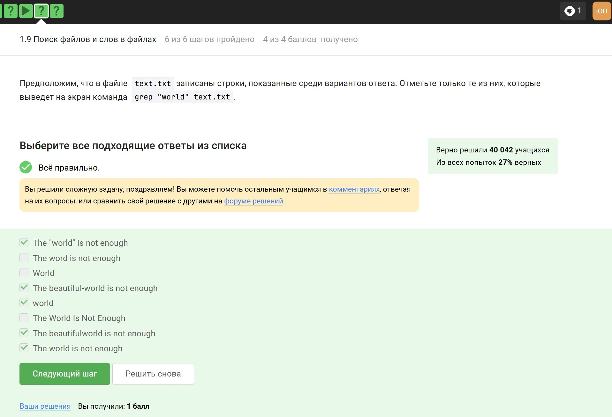{#fig:031 width=90%}

Шаг 6 - (рис. [-@fig:032]). Здесь я скачала архив.

{#fig:032 width=90%}

Шаг 6 - (рис. [-@fig:033]). Распаковываем скачанный архив, результат команды grep поиска шаблона рекурсивно в распакованной ранее папке отправляем в результирующий файл.

{#fig:033 width=90%}

# Выводы

Был полностью завершен первый раздел внешнего курса.
